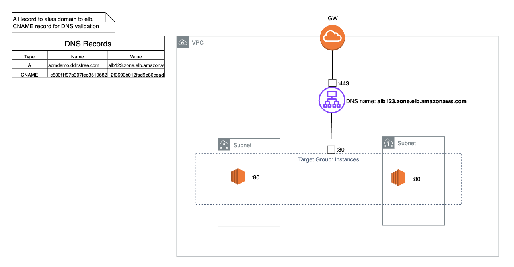

# Objective

- Integrate third-part domain with AWS
- Receive a HTTPS response from a third party domain.
- Loadbalancing across zones.

Architecture:


# AWS Resources Provisioning

- VPC
  - Use default.
- EC2 [json](ec2.json)
  - Create 2 instances in separate zones.
    - Start http server on both instances with respective numbering:
      ```
      sudo dnf update -y
      sudo dnf install httpd -y
      sudo sh -c 'echo "Hi this is instance #1" > /var/www/html/index.html'
      sudo systemctl start httpd
      ```

- Target Group [json](targetgroup.json)
  - register instances into target.
  - ensure default http port 80 is exposed.


- ALB [json](loadbalancer.json)
    Create a load balancer to route traffic to target group.
  - Security Group [json](albsecuritygroup.json)
    - Allow inbound 443 traffic:
        ```
        {
          "SecurityGroups": [
            {
              "Description": "default VPC security group",
      ....
              "IpPermissions": [
                {
                  "IpProtocol": "tcp",
                  "FromPort": 443,
                  "ToPort": 443,
                  "UserIdGroupPairs": [],
                  "IpRanges": [
                    {
                      "CidrIp": "0.0.0.0/0"
                    }
                  ],
                  "Ipv6Ranges": [],
                  "PrefixListIds": []
                }
              ]
            }
          ]
        }
      ```

- SSL Certificate [json](certificate.json)\
The certificate is will be created during [SSL generation](#generate-ssl-certificate-create-record-to-point-to-alb).


# DNS Integration for SSL Certifcation


## Domain Creation

use a DNS provider. we are using dynu.dns (`www.dynu.com`) as it is free to use.
Create a dummy DNS record if required, only need to ensure domain is in ownership.

domain_name: `acmdemo.ddnsfree.com`

##  Create A Record to point to ALB

| A | acmdemo.ddnsfree.com	 | alb123.zone.elb.amazonaws.com |
|---|-----------------------|-------------------------------|


## Generate SSL Certificate Create Record to point to ALB

Go to AWS Certificate Manager and create certificate for the DNS. Using DNS validation, A CNAME record provided is to be added with the DNS provider:

Resource Reference:
```
...
                "ResourceRecord": {
                    "Name": "_c530f1f97b307fed3610682978deda27.acmdemo.ddnsfree.com.",
                    "Type": "CNAME",
                    "Value": "_2f3693b012fad9e80cead2b54fae5591.xlfgrmvvlj.acm-validations.aws."
                },
```

Using nslookup after adding to DNS record table:

| CNAME | _c530f1f97b307fed3610682978deda27.acmdemo.ddnsfree.com. | _2f3693b012fad9e80cead2b54fae5591.xlfgrmvvlj.acm-validations.aws. |
|-------|---------------------------------------------------------|-------------------------------------------------------------------|

# Diagnostics

Try `curl https://acmdemo.ddnsfree.com` should response with the custom html from the two instances randomly (determined by route algo).
Getting an HTTPS 200 response directly from ALB DNS name will fail, as the domain name of the certificate will not match the ALB name.


# Commands References

## describes
`aws elbv2 describe-target-groups`\
`aws elbv2 describe-load-balancers`\
`aws ec2 describe-instances`\
`aws ec2 describe-security-groups`


# tear down
`aws elbv2 delete-load-balancer --load-balancer-arn "arn:aws:elasticloadbalancing:ap-northeast-1:692859948557:loadbalancer/app/load-balancer/f4cc2ad927fb4a5a" --region ap-northeast-1`\
`aws ec2 terminate-instances --instance-ids i-09c51c108ba8cbf5d --region ap-northeast-1`\
`aws acm delete-certificate --certificate-arn arn:aws:acm:ap-northeast-1:692859948557:certificate/7b09c43a-ba39-42aa-8e29-fa2b02dd437a --region ap-northeast-1`\
`aws elbv2 delete-target-group --target-group-arn arn:aws:elasticloadbalancing:ap-northeast-1:692859948557:targetgroup/target-group/a769688f64ce5a98 --region ap-northeast-1`\
